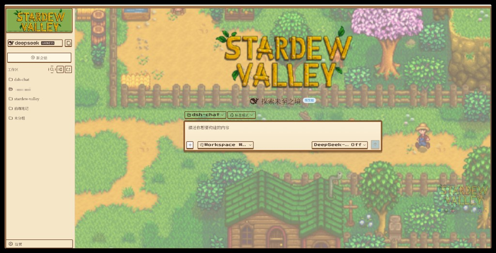
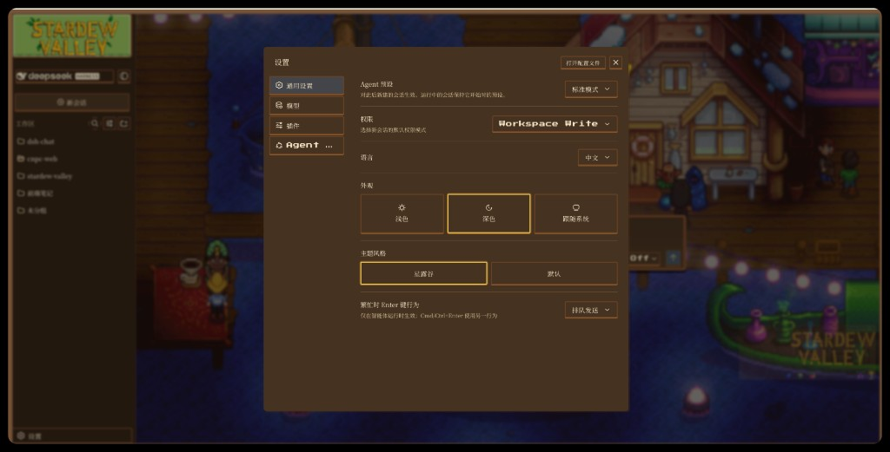

# dsh-theme-stardew

[中文](./README.md)

A **Stardew Valley themed client plugin** for the [DeepSeek Harness](https://github.com/deepseek-ai/deepseek-harness) web surface. It turns the whole browser UI into a warm, pixel-art farm (chat bubbles, sidebar logo, farmhouse palette, code-drawn scene, day/night atmosphere) — non-commercial fan work.

> ⚠️ **Asset notice** — this package bundles official Stardew Valley artwork (the logo, crop/NPC sprites, and in-game scene screenshots) for **personal / non-commercial fan use only**. All artwork is © ConcernedApe / Stardew Valley. If you plan to **distribute or publish this package, review whether redistribution of those assets is permitted before releasing**; consider omitting `src/styles/*.png|gif` and relying on code-drawn backgrounds if you cannot clear them.

## Preview

**Day**



**Night** (Settings → General → Appearance **Dark** + Theme style **星露谷**)



## What it does

- Injects the full Stardew stylesheet (all images base64-inlined, self-contained) at runtime — no shell `base.css` changes needed.
- Turns on via the `data-sd-stardew` document attribute (`html[data-sd-stardew]`).
- Adds a **星露谷 / 默认** toggle row in **Settings → General → 主题风格**, persisted in `localStorage['dsh.ui-stardew.enabled']`.
- Keeps the shipped chat fully functional — the theme is visual only.

## Install

This is a `dsh.client` plugin **and** a profile bundle (`dsh.bundle`). Publishing it to npm (or pointing at its git repo) lets anyone mount the theme into a web profile with a single command. The bundle's `cordis.patch.yml` inserts the client roster row, and the modules node half resolves the `./client` bundle into `window.__DSH_BOOT__`.

```bash
# published on npm
dsh plugin --profile web add dsh-theme-stardew

# or direct from a git repo / tarball
dsh plugin --profile web add <owner>/dsh-theme-stardew
dsh plugin --profile web add ./dsh-theme-stardew-0.1.6.tgz
```

If a regional npm mirror is behind, install from the official registry:

```bash
pnpm add dsh-theme-stardew@latest --registry https://registry.npmjs.org/
```

Then start the web surface and open **Settings → General → 主题风格 → 星露谷** (or set `localStorage['dsh.ui-stardew.enabled'] = 'on'`). Light / Dark appearance maps to the day / night farm scenes.

> The theme defaults **OFF** in this standalone plugin (opt-in; unlike the shipped ui-theme which defaults ON).

### Manual (without `dsh plugin add`)

If you do not want the package treated as a profile bundle, mount it by adding its client roster row to the web profile's patch layer (e.g. `$DSH_HOME/cordis.patch.yml`):

```yaml
- insert:
    - id: theme-stardew
      name: 'dsh-theme-stardew'
```

and ensure `dsh-theme-stardew` is resolvable where dsh runs.

## Package layout

```
dsh-theme-stardew/
├─ docs/
│  ├─ preview-day.jpg    # README day preview
│  └─ preview-night.jpg  # README night preview
├─ lib/
│  ├─ client.js          # browser plugin bundle (window.__ModuleLoader__.load)
│  ├─ index.js           # node-half empty apply (required by Host Cordis)
│  └─ styles/            # raw stylesheet + assets (./styles/* export)
├─ src/
│  ├─ index.ts           # node-half stub (export apply)
│  └─ client/            # plugin apply(), StardewRow, store, theme-css.ts
├─ src/styles/stardew.css
├─ cordis.patch.yml      # inserts the client row into the profile roster
├─ README.md             # Chinese (default)
├─ README.en.md          # English
└─ package.json          # dsh.client / dsh.bundle + ./client & ./styles exports
```

## Build from source

`src/client/theme-css.ts` embeds the stylesheet with images inlined (generated). Any change to `src/styles/stardew.css` must regenerate it:

```bash
# 1) regenerate the embedded css module
python3 scripts/embed-css.py

# 2) build the client bundle
pnpm run build   # tsdown -> lib/client.js  (+ copies src/styles -> lib/styles)
```

## License

MIT for the plugin *code* — see [LICENSE](LICENSE).

Theme **artwork is not** MIT; it is © ConcernedApe (Stardew Valley), used here for non-commercial fan purposes. Redistribution of the bundled artwork is at your own responsibility.
